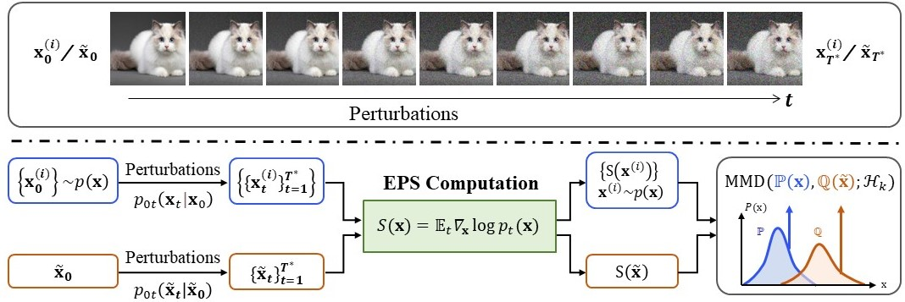

# Detecting Adversarial Data by Probing Multiple Perturbations Using Expected Perturbation Score

<p align="center">
  
</p>

Official PyTorch implementation of the ICML 2023 paper:

<!-- **Detecting Adversarial Data by Probing Multiple Perturbations Using Expected Perturbation Score** -->
**[Detecting Adversarial Data by Probing Multiple Perturbations Using Expected Perturbation Score](https://arxiv.org/abs/2305.16035)**

Shuhai Zhang, Feng Liu, Jiahao Yang, Yifan Yang, Changsheng Li, Bo Han, Mingkui Tan

Abstract: *Adversarial detection aims to determine whether a given sample is an adversarial one based on the discrepancy between natural and adversarial distributions. Unfortunately, estimating or comparing two data distributions is extremely difficult, especially in high-dimension spaces. Recently, the gradient of log probability density (a.k.a., score) w.r.t. the sample is used as an alternative statistic to compute. However, we find that the score is sensitive in identifying adversarial samples due to insufficient information with one sample only. In this paper, we propose a new statistic called expected perturbation score (EPS), which is essentially the expected score of a sample after various perturbations. Specifically, to obtain adequate information regarding one sample, we perturb it by adding various noises to capture its multi-view observations. We theoretically prove that EPS is a proper statistic to compute the discrepancy between two samples under mild conditions. In practice, we can use a pre-trained diffusion model to estimate EPS for each sample. Last, we propose an EPS-based adversarial detection (EPS-AD) method, in which we develop EPS-based maximum mean discrepancy (MMD) as a metric to measure the discrepancy between the test sample and natural samples. We also prove that the EPS-based MMD between natural and adversarial samples is larger than that among natural samples. Extensive experiments show the superior adversarial detection performance of our EPS-AD.*

## Requirements

- An RTX 3090 with 24 GB of memory.
- Python 3.7
- Pytorch 1.7.1

## Data and pre-trained models

Note that you have to put the datasets in the `./dataset` directory.

For the pre-trained diffusion models, you need to first download them from the following links and put them in the `./pretrained` directory:

- [Score SDE](https://github.com/yang-song/score_sde_pytorch) for
  CIFAR-10: (`vp/cifar10_ddpmpp_deep_continuous`: [download link](https://drive.google.com/file/d/16_-Ahc6ImZV5ClUc0vM5Iivf8OJ1VSif/view?usp=sharing))
- [Guided Diffusion](https://github.com/openai/guided-diffusion) for
  ImageNet: (`256x256 diffusion unconditional`: [download link](https://openaipublic.blob.core.windows.net/diffusion/jul-2021/256x256_diffusion_uncond.pt))

For the checkpoint of the trained kernels on Cifar and ImageNet:

- [Cifar](https://drive.google.com/drive/folders/1doMYCEaTl3R20vDJmp59disepeTG7nb-?usp=drive_link)
- [ImageNet](https://drive.google.com/drive/folders/1hAYYgRQsIpc9yQK8TTPde8_49Va8_fz-?usp=drive_link)

You need to put the kernel on Cifar in the `net_D/cifar/8` directory and the kernel on ImageNet in the `net_D/imagenet/6` directory.

## Environment of EPS-AD
You have to create a virtual environment and set up libraries needed for training and evaluation.
```
conda env create -f epsad.yaml
pip install git+https://github.com/RobustBench/robustbench.git
```

## Quick start
You can use your preferred image folders to run the following commands. Before running the commands, you need to download the pre-trained diffusion models and kernels, and put them in the obove corresponding directory.

**1. Detecting the clean samples on CIFAR-10.**
```
python test_demo.py \
  --id 8 \
  --num_sub 500 \
  --adv_batch_size 500 \
  --detection_datapath '.\' \
  --diffuse_t 20 \
  --perb_image \
  --epsilon 0.00392 \
  --domain cifar10 \
  --dataset cifar \
  --loader None \
  --clean_score_flag
```
Note that You can specify your preferred loader using "--loader". You can also use "--attack_methods FGSM_L2" to specify the attack methods, such as FGSM, PGD, and remove the flag "--clean_score_flag" to detect the adversarial samples.


**2. Detecting the samples on ImageNet.**

```
python test_demo.py \
  --id 6 \
  --datapath './dataset/imagenet' \
  --classifier_name imagenet-resnet50 \
  --config imagenet.yml \
  --num_sub 500 \
  --adv_batch_size 32 \
  --detection_datapath './' \
  --diffuse_t 50 \
  --perb_image \
  --epsilon 0.00392 \
  --domain imagenet \
  --dataset imagenet \
  --clean_score_flag
```
Note that "--datapath" is the path of Imagenet dataset, if you have your own data loader customized in "--loader", you can ignore the term "--datapath".

## Run experiments on CIFAR-10

**1. Train a deep kernel for MMD.**

- To obtain the EPSs of nature and adversarial samples under FGSM and FGSM_L2 attack with $\epsilon=1/255$ :

<!-- # generate nature samples -->
```
CUDA_VISIBLE_DEVICES=0
python eval_epsad.py  --num_sub 10000 \
    --adv_batch_size 200 \
    --detection_datapath './score_diffusion_t_cifar_1w'  \
    --epsilon 0.00392 \
    --diffuse_t 20  \
    --perb_image \
    --attack_methods FGSM FGSM_L2 \
    --single_vector_norm_flag \
    --generate_1w_flag \
    --clean_score_flag
```

```
CUDA_VISIBLE_DEVICES=0
python eval_epsad.py  --num_sub 10000 \
    --adv_batch_size 200 \
    --detection_datapath './score_diffusion_t_cifar_1w'  \
    --epsilon 0.00392 \
    --diffuse_t 20  \
    --perb_image \
    --attack_methods FGSM FGSM_L2 \
    --single_vector_norm_flag \
    --generate_1w_flag
```

- To train a deep kernel MMD with the EPSs of FGSM and FGSM_L2 adversarial samples:
```
CUDA_VISIBLE_DEVICES=0
python train_D.py --epochs 200 --lr 0.002 --id 8 --sigma0 15 --sigma 100  --epsilon 2 --feature_dim 300 --dataset cifar
```

Note that through all our experiments, we use only FGSM and FGSM-$\ell_{2}$ adversarial samples ($\epsilon=1/255$), $10,000$ each, along with $10,000$ nature samples to calculate their EPSs to train the deep kernel, which can also be trained on a general public dataset. Moreover, our method is suitable for detecting all the $\ell_2$ and $\ell_\infty$ adversarial samples.

In the following, we use the EPSs of a set of nature samples with size=500 as the refernce, then perform adversarial detection with the trained deep-kernel MMD.

**2. Detecting adversarial data with EPS-AD**

- To obtain EPSs of adversarial samples with other attack intensities (e.g., $\epsilon=4/255$):
```
CUDA_VISIBLE_DEVICES=0
python eval_epsad.py --detection_datapath './score_diffusion_t_cifar_stand' \
    --num_sub 500 \
    --adv_batch_size 500 \
    --epsilon 0.01569 \
    --diffuse_t 20 \
    --single_vector_norm_flag \
    --perb_image 
```

- To obtain EPSs of nature samples:
```
CUDA_VISIBLE_DEVICES=0
python eval_epsad.py --detection_datapath './score_diffusion_t_cifar_stand' \
    --num_sub 500 \
    --adv_batch_size 500 \
    --epsilon 0.01569 \
    --diffuse_t 20 \
    --single_vector_norm_flag \
    --perb_image \
    --clean_score_flag
```

- To calculte the MMD between EPS of each test sample and EPSs of natural samples and obatin a AUROC:
```
CUDA_VISIBLE_DEVICES=0
python train_D.py --epochs 200 --lr 0.002 --id 8 --sigma0 15 --sigma 100  --epsilon 2 --feature_dim 300 --dataset cifar --test_flag True
```


## Run experiments on ImageNet
**1. Train a deep kernel for MMD.**

- To obtain the EPSs of nature samples and adversarial samples under FGSM and FGSM_L2 attack with $\epsilon=1/255$ :


<!-- # generate nature samples -->
```
CUDA_VISIBLE_DEVICES=0
python eval_epsad.py --datapath './dataset/imagenet' \
    --num_sub 10000 \
    --adv_batch_size 32 \
    --detection_datapath './score_diffusion_t_imagenet_1w'  \
    --single_vector_norm_flag \
    --config imagenet.yml \
    -i imagenet \
    --domain imagenet \
    --classifier_name imagenet-resnet50 \
    --diffuse_t 50  \
    --perb_image \
    --attack_methods FGSM FGSM_L2 \
    --epsilon 0.00392 \
    --generate_1w_flag \
    --clean_score_flag
```

```
CUDA_VISIBLE_DEVICES=0
python eval_epsad.py --datapath './dataset/imagenet' \
    --num_sub 10000 \
    --adv_batch_size 32 \
    --detection_datapath './score_diffusion_t_imagenet_1w'  \
    --single_vector_norm_flag \
    --config imagenet.yml \
    -i imagenet \
    --domain imagenet \
    --classifier_name imagenet-resnet50 \
    --diffuse_t 50  \
    --perb_image \
    --attack_methods FGSM FGSM_L2 \
    --epsilon 0.00392 \
    --generate_1w_flag
```

- To train a deep kernel MMD with the EPSs of FGSM and FGSM_L2 adversarial samples:
```
CUDA_VISIBLE_DEVICES=0
python train_D.py --epochs 200 --lr 0.002 --id 6 --sigma0 0.5 --sigma 100  --epsilon 10 --feature_dim 300 --dataset imagenet
```

**2. Detecting adversarial data with EPS-AD**

- To obtain EPSs of adversarial samples with other attack intensities (e.g., $\epsilon=4/255$):
```
CUDA_VISIBLE_DEVICES=0
python eval_epsad.py --datapath './dataset/imagenet' \
    --num_sub 500 \
    --adv_batch_size 32 \
    --detection_datapath './score_diffusion_t_imagenet_stand'  \
    --config imagenet.yml \
    -i imagenet \
    --domain imagenet \
    --classifier_name imagenet-resnet50 \
    --diffuse_t 50  \
    --epsilon 0.01569 \
    --single_vector_norm_flag \
    --perb_image
```

- To obtain EPSs of nature samples:
```
CUDA_VISIBLE_DEVICES=0
python eval_epsad.py --datapath './dataset/imagenet' \
    --num_sub 500 \
    --adv_batch_size 32 \
    --detection_datapath './score_diffusion_t_imagenet_stand'  \
    --config imagenet.yml \
    -i imagenet \
    --domain imagenet \
    --classifier_name imagenet-resnet50 \
    --diffuse_t 50  \
    --epsilon 0.01569 \
    --single_vector_norm_flag \
    --perb_image \
    --clean_score_flag
```

- To calculte the MMD between EPS of each test sample and EPSs of natural samples and obatin a AUROC:
```
CUDA_VISIBLE_DEVICES=0
python train_D.py --epochs 200 --lr 0.002 --id 6 --sigma0 0.5 --sigma 100  --epsilon 10 --feature_dim 300 --dataset imagenet --test_flag True
```


## Citation


```
@inproceedings{zhangs2023EPSAD,
  title={Detecting Adversarial Data by Probing Multiple Perturbations Using Expected Perturbation Score},
  author={Zhang, Shuhai and Liu, Feng and Yang, Jiahao and Yang, Yifan and Li, Changsheng and Han, Bo and Tan, Mingkui},
  booktitle = {International Conference on Machine Learning (ICML)},
  year={2023}
}
```
